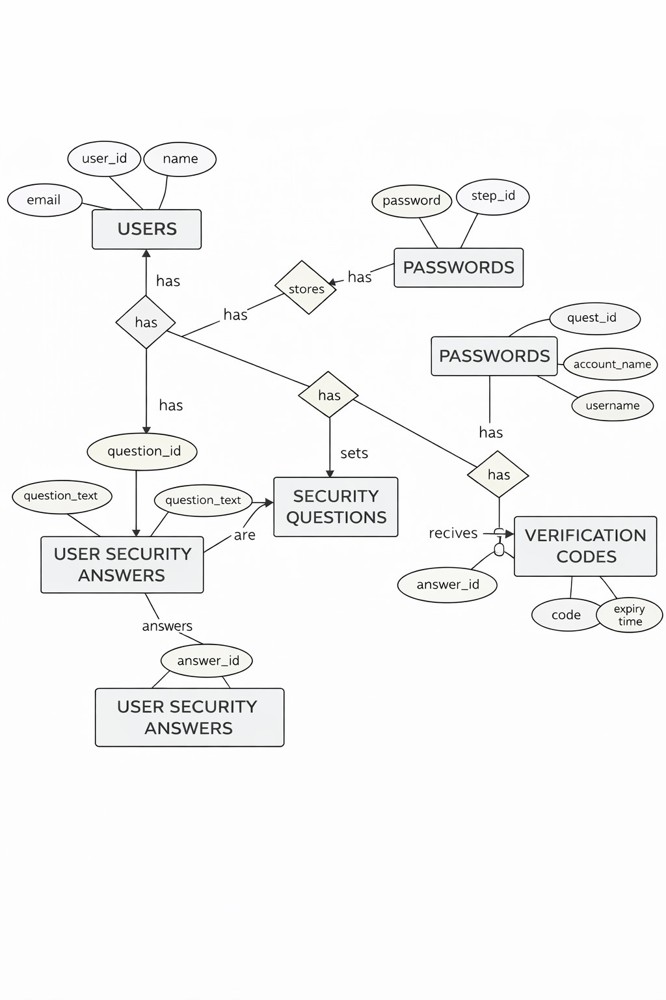

# 🔐 RevPasswordManager – Secure Password Management System


## 📌 Overview

RevPassword Manager is a secure, console-based password management application built using **Java**, **MySQL**, and **JDBC**. The system allows users to:

* Register & Login
* Store multiple account passwords
* Encrypt passwords using AES
* Set and verify security questions
* Reset forgotten passwords using verification codes
* Follow a clean multi‑layered architecture (Service, DAO, Utility)

---

## 🏗️ Architecture Diagram


### ✔️ Presentation Layer

* `MainApp.java` → Handles user interaction and console UI

### ✔️ Service Layer (`com.revature.service`)

Contains all business logic:

* `UserService`
* `PasswordService`
* `SecurityService`
* `VerificationCodeService`

### ✔️ DAO Layer (`com.revature.dao`)

Handles all database CRUD operations:

* `UserDAO`
* `PasswordDAO`
* `SecurityQuestionDAO`
* `VerificationCodeDAO`

### ✔️ Utility Layer (`com.revature.util`)

Helper classes:

* `DBConnectionUtil`
* `AESUtil / PasswordUtil`
* `EmailValidatorUtil`
* `PasswordValidatorUtil`

### ✔️ Database Layer (MySQL)

Tables:

* `users`
* `passwords`
* `security_questions`
* `user_security_answers`
* `verification_codes`

---

## 🗃️ ER Diagram



### ✔️ Entities

* Users
* Passwords
* Security Questions
* User Security Answers
* Verification Codes

### ✔️ Relationships

* A user **has many** saved passwords
* A user **sets** security questions
* A question **has many** answers
* A user receives **verification codes** for password reset

---

## 📂 Project Structure

```
RevPasswordManager/
│
├── com.revature.main
│     └── MainApp.java
│
├── com.revature.service
│     ├── UserService.java
│     ├── PasswordService.java
│     ├── SecurityService.java
│     └── VerificationCodeService.java
│
├── com.revature.dao
│     ├── UserDAO.java
│     ├── PasswordDAO.java
│     ├── SecurityQuestionDAO.java
│     └── VerificationCodeDAO.java
│
├── com.revature.model
│     ├── User.java
│     ├── PasswordEntry.java
│     ├── SecurityQuestion.java
│     ├── UserSecurityAnswer.java
│     └── VerificationCode.java
│
├── com.revature.util
│     ├── DBConnectionUtil.java
│     ├── AESUtil.java
│     ├── EmailValidatorUtil.java
│     └── PasswordValidatorUtil.java
│
└── resources/
      └── database.sql
```

---

## 💾 Database Tables

### ✔️ `users`

| Column   | Type     |
| -------- | -------- |
| user_id  | INT (PK) |
| name     | VARCHAR  |
| email    | VARCHAR  |
| password | VARCHAR  |

### ✔️ `passwords`

| Column       | Type                    |
| ------------ | ----------------------- |
| step_id      | INT (PK)                |
| user_id      | INT (FK)                |
| account_name | VARCHAR                 |
| username     | VARCHAR                 |
| password     | VARCHAR (AES encrypted) |

### ✔️ `security_questions`

| Column        | Type     |
| ------------- | -------- |
| question_id   | INT (PK) |
| question_text | VARCHAR  |

### ✔️ `user_security_answers`

| Column      | Type     |
| ----------- | -------- |
| answer_id   | INT (PK) |
| user_id     | INT (FK) |
| question_id | INT (FK) |
| answer_text | VARCHAR  |

### ✔️ `verification_codes`

| Column      | Type     |
| ----------- | -------- |
| code_id     | INT (PK) |
| user_id     | INT (FK) |
| code        | VARCHAR  |
| expiry_time | DATETIME |

---

## 🔐 Security Features

* AES encryption for passwords
* Input validation (email + password format)
* Security question verification
* Verification codes for password reset
* Safe JDBC queries (Prepared Statements)

---

## ▶️ How to Run

1. Import project into **Eclipse / IntelliJ**
2. Update MySQL credentials in `DBConnectionUtil.java`
3. Execute `database.sql` to create tables
4. Run `MainApp.java`
5. Application starts in Console UI

---

## GitHub Description
RevPassword Manager is a secure Java-based password management system using MySQL and JDBC. 
It supports AES encryption, security questions, verification codes, and follows a clean multi-layer architecture. 
Perfect for showcasing backend development, JDBC, SQL design, and modular Java practices.

## 🚀 Future Enhancements

* JavaFX GUI
* Password strength analyzer
* MFA (Multi-factor authentication)
* Cloud sync

---


